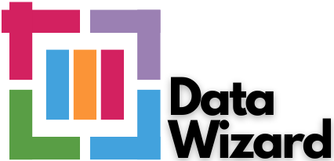

## Final Project - Financial Service

 

  

  <h3 align="center">Data Wizard - Kelompok1A</h3>

  

    All information related to the MSIB batch 5 data science final assignment at Rakamin Academy
     
    <a href="https://drive.google.com/file/d/1QJ3XaEeUPJBVdyxxKAninCd4ZjdiO7gt/view?usp=share_link">
        <strong>Kick Off Final Project >></strong>
      </a>
  

### Table of Contents

1. [Introduction](#introduction)
2. [Feature](#Feature)
3. [Installation](#Installation)
4. [Usage](#Usage)
5. [Contributing](#Contributing)
6. [Roadmap](#Roadmap)
7. [Note](#Note)

### Introduction
This project is a group project called Data Wizard which focuses on the topic of financial service. This project aims to build a machine learning model that can predict whether someone will be at risk of loan default or not. This model will be built using a dataset sourced from Kaggle.

### Feature
The project performs various features, such as:

1. Data Collection: We acquire financial data from Kaggle, which serves as the foundation for our machine learning model.
2. Visualization: We visualize the results and key insights to make the model's predictions more interpretable.
3. Data Preprocessing: We clean, transform, and prepare the dataset for model training. 
4. Machine Learning Model: We build, train, and optimize a predictive model that evaluates loan default risk.
5. Evaluation Metrics: We assess the model's performance using relevant metrics like accuracy, precision, and recall.
6. Documentation: This readme serves as part of our documentation, providing an overview of the project.

### Installation
To get started with our project, follow these installation steps:

1. git clone the project repository from our GitHub repository: https://github.com/HafiizhTH/FinalProject_Kelompok1A.git

### Usage

### Contributing

### Roadmap

### Note

